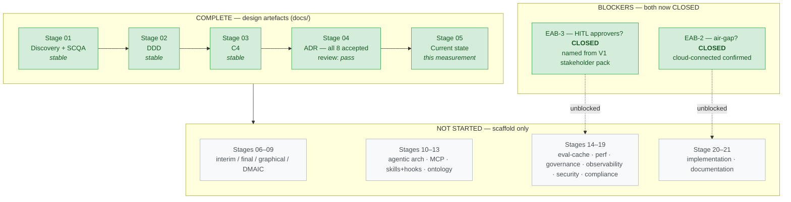
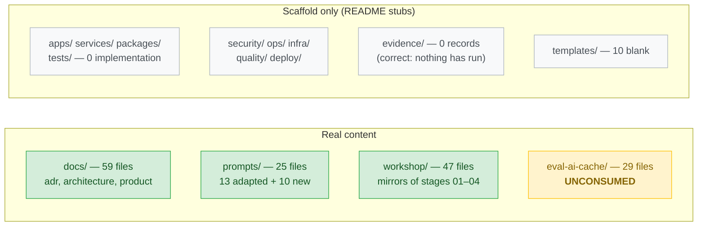

# Current State — Graphical View — Stage 08

**Source of truth:** `docs/product/state/current/current_state_assessment.md` (measured
2026-08-12: 249 tracked files, 4 of 21 stages complete, zero implementation).

## What exists today

## Repository content: real vs. scaffold

**The amber box is the notable one:** `eval-ai-cache/` holds 29 files of directly-applicable
reference material (24-file brownfield-evals runbook, Redis caching runbook, OpenTelemetry
runbook) that no stage has drawn on yet. Stages 14/15/17 should consume it rather than
derive equivalents (NAB-4).

## Honest reading of this view

There is **no system** yet — only design artefacts and their mirrors. That is correct and
intentional (Stage 20 is deliberately last), but it means every architectural claim made so
far is unvalidated by execution. The interim state exists precisely to change that.
