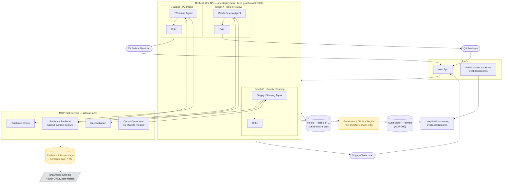
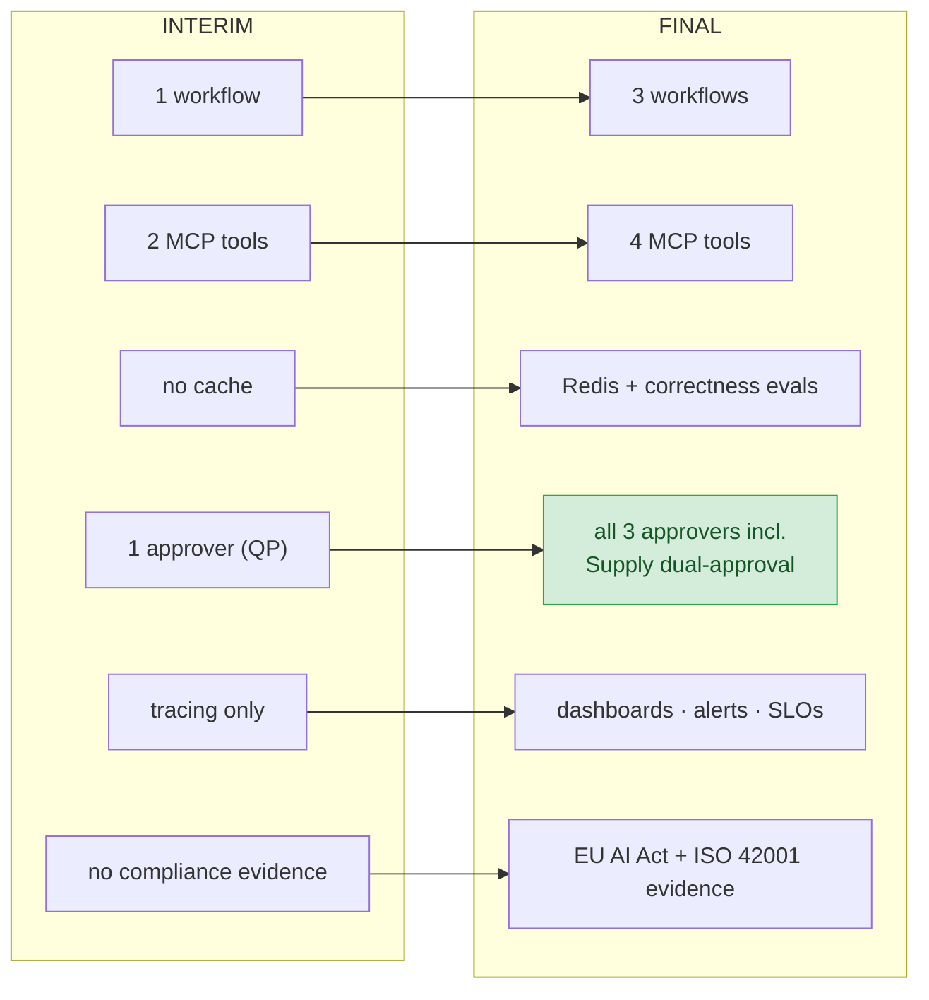
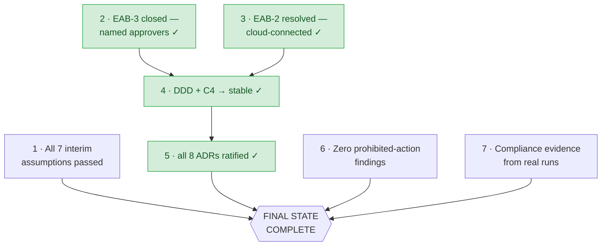

# Final State — Graphical View — Stage 08

**Source of truth:** `docs/product/state/final/final_state.md`, `docs/architecture/c4/`

## Target system — three graphs, one deployment

**Note the absent arrows.** There is no edge between Graph A, B, and C — ADR-008 forbids
cross-graph agent calls permanently. There is no arrow *into* the brownfield systems — zero
write integrations, permanently. Both absences are the design, not an omission.

## Interim → final delta

EAB-3 is **closed** — all three approver roles are named from V1's stakeholder pack. Note
that Supply Planning requires **dual approval** (Supply Chain VP *plus* Quality wherever
quality status is implicated), because the stakeholder pack limits the VP to planning and
states that "regulated execution needs approvals".

## Completion gates

Gates 2–5 (green) are **satisfied**. Gates 2 and 3 required human answers rather than
engineering work, and both have been given: approvers named from V1's stakeholder pack, and
cloud-connected operation confirmed. The three remaining gates (1, 6, 7) cannot be closed by
design work at all — they require the system to actually run.
