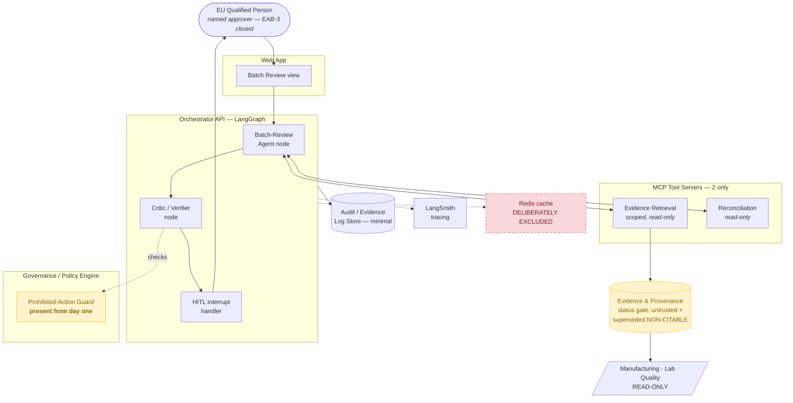
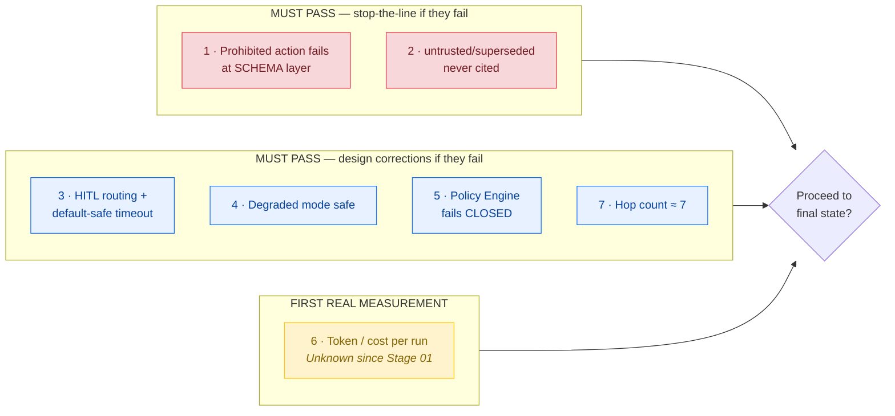

# Interim State — Graphical View — Stage 08

**Source of truth:** `docs/product/state/interim/interim_state.md`
One workflow (Batch Review) end-to-end, proving seven assumptions before replication.

## Interim runtime — the minimum governed workflow

**Why no cache:** introducing the stale-authority risk alongside agent-correctness risk
makes failures ambiguous. Cache lands only after the uncached path is proven correct.

**Why the guard is not staged:** ADR-004's argument is that prohibited-action enforcement
cannot be retrofitted safely — so it is present in the very first slice.

## The seven assumptions under test

Assumption 6 carries disproportionate weight: it is the first point in the entire programme
where a real cost number exists. If it lands far off expectation, the final state's topology
changes **before** it is built three times over.
