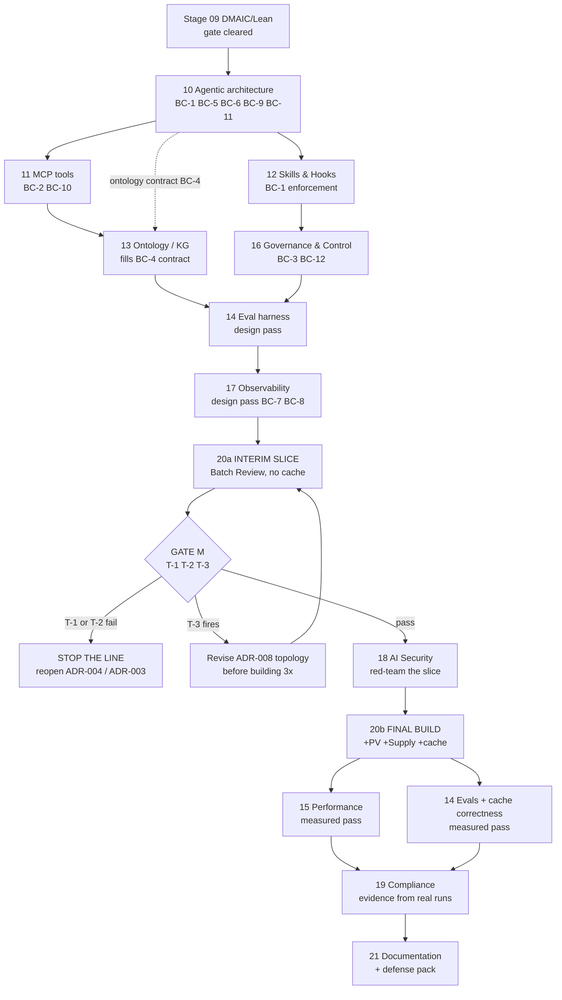

# Execution Plan — Stages 10–21

**Created:** end of Stage 09 (2026-08-12) · **Status: `active`**
**Governing inputs:** [`docs/quality/dmaic-lean/`](../../docs/quality/dmaic-lean/) (build
constraints, revisit triggers), [`STAGES.md`](../../STAGES.md),
[`SPEC_DRIVEN_DEVELOPMENT.md`](../../SPEC_DRIVEN_DEVELOPMENT.md) §3,
[`PROJECT_SUMMARY.md`](../../PROJECT_SUMMARY.md)

**What this is:** the delivery plan for the remaining 12 stages — sequence, dependencies,
gates, decision points, and the feedback loops the linear stage list does not express.
**What this is not:** a stage spec. The `prompts/` files remain the per-stage specs (NAB-2:
they are not duplicated here). **No calendar estimates** — this programme has no velocity data
and inventing dates would be exactly the kind of unmeasured number Stage 09 spent its Measure
section refusing to produce.

---

## 1. The sequencing problem this plan exists to solve

The stage list runs 10 → 21 linearly, with implementation at 20. But Stage 09 put the
programme in **Measure-first** mode, and *every* baseline that matters (token cost, latency,
eval pass rate, hop count) becomes measurable **only when code runs — at Stage 20.**

Read linearly, that means stages 14 (evals), 15 (performance), 19 (compliance) would each be
"completed" while the numbers they exist to produce are still Unknown, and Stage 20 would
build all three workflows before the first cost measurement exists — which is precisely the
failure mode `interim_state.md` and trigger **T-3** were written to prevent.

**Resolution: Stage 20 splits into 20a and 20b, with a measurement gate between them.**

| | Scope | Produces |
|---|---|---|
| **20a — interim slice** | Batch Review only, end-to-end, no cache, Prohibited-Action Guard from day one | The 7 interim assumption results, incl. **the programme's first real cost number** |
| **⟨GATE M⟩** | Evaluate 20a against triggers T-1, T-2, T-3 | Proceed / revise topology / stop the line |
| **20b — final build** | PV Intake + Supply Planning graphs, Redis cache, full dashboards | The system the final state describes |

Stages 14, 15, 17 and 19 each therefore have **two passes**: a design pass before 20a, and a
measured pass after it. This is not rework — it is the design-then-measure loop the whole
method assumes, made explicit so nobody reports a Measure stage as complete on estimates.

## 2. Ground rules carried into every stage

1. **One branch per stage**, already created. Work on the stage branch; fast-forward
   downstream stage branches after each commit. **`main` is deliberately not kept in sync.**
2. **Write to the stage's `docs/` (or code) home *and* mirror** to
   `workshop/participant-output/`. Use the mirror folder name **the prompt states**
   (`14-agentic-architecture`, `15-mcp`, …) — see §7 note on the existing naming collision.
3. **Every stage produces a `dmaic_lens.md`** (thin unless the prompt says full — 18 and 22
   are full). They roll up again at Stage 21.
4. **Status honesty:** `provisional` until dependencies are `stable`. "Designed" is never
   reported as "measured."
5. **Verify V1 behaviour against V1 code**, never from filenames (ADR-002 guardrail; the
   ADR-003 correction is the precedent).
6. **Consume `eval-ai-cache/` (29 files) and V1's `knowledge/` (32 docs)** rather than
   re-deriving — trigger T-7 makes this a Measure-step obligation at Stage 14.
7. **Azure is the deployment target, not a development prerequisite.** Only LLM inference
   needs cloud. See §6.

## 3. Stage-by-stage plan

Each row: what it consumes, what it must produce, the Stage-09 constraints it is on the hook
for, and its exit gate.

### Wave 1 — Design the governed slice (stages 10–13)

| Stage | Consumes | Produces (per prompt) | Stage-09 constraints it must satisfy | Exit gate |
|---|---|---|---|---|
| **10 Agentic architecture** `prompts/14` → `docs/architecture/agentic/` | DDD §14–15, C4 components, ADR-001/004/008, **BC §A** | `agent_roster.md`, `langgraph_design.md`, `memory_design.md`, `failure_and_loop_guards.md` | **BC-1** guard day one · **BC-5** retry/diagnosis rules (the item that lost its owner) · **BC-6** Critic complementary to deterministic gates · **BC-7** token accounting designed in · **BC-9** shared-state schema as single source · **BC-11** zero cross-graph calls, structurally · **BC-4** design against an ontology *contract* | Graph design covers all 7 interim assumptions' instrumentation points; no node depends on a prompt instruction for a prohibition |
| **11 MCP tools** `prompts/15` → `services/integration/`, `packages/contracts/` | Stage 10 graph, ADR-003/004 | `tool_inventory.md`, `tool_contracts/*.schema.json`, `prohibited_write_enforcement.md` | **BC-2** status gate at the retrieval boundary, before ranking · **BC-10** versioned schemas + `tests/contract/` from the first tool | The two interim tools (Evidence Retrieval, Reconciliation) have contracts with **no write method** for any prohibited action |
| **12 Skills & Hooks** `prompts/16` → `.claude/skills/`, `.claude/hooks/` | ADR-004 layer 3, Stage 11 contracts | `skills.md`, `hooks.md`, `skill_vs_hook_boundary.md` | **BC-1** — the Prohibited-Action Guard is a *hook*, i.e. enforced, not an instruction | Guard fires on a red-team attempt in a dry run |
| **13 Ontology / KG** `prompts/17` → `docs/architecture/ontology/`, `packages/domain/` | Stage 10's BC-4 contract, ADR-003, V1 `knowledge/` (32 docs) | `ontology.md`, `kg_schema.md`, `semantic_layer_query_contract.md`, `conflict_authority_rules.md` | **BC-4** fills the contract · **BC-20** decide NAB-3 (copy V1 knowledge locally vs. cross-repo) *here*, it blocks this stage | Scoped, status-aware retrieval is expressible without raw-document RAG |

### Wave 2 — Design the controls (stages 16, 14, 17 — design pass)

Deliberately reordered from the numeric sequence: **governance and eval design must exist
before the slice runs**, and observability must be instrumented before the first trace,
not after.

| Stage | Consumes | Produces | Constraints | Exit gate |
|---|---|---|---|---|
| **16 Governance & Control** `prompts/20` → `docs/governance/`, `security/policies/` | ADR-004/005, `hitl_control_model.md` (**already exists** — extend, do not overwrite), named approver roles | `policy_register.md`, `escalation_override_log_design.md`, `control_ownership.md` | **BC-3** fails closed · **BC-12** timeout ⇒ no action; roles not individuals · **BC-17** Batch-Review-only risk-tiering deferred until U7 exists | Policy Engine refuses when unreachable, in design *and* in a test |
| **14 Eval harness (design pass)** `prompts/18` → `eval-ai-cache/`, `quality/gates/`, `tests/` | V1's 12 categories + 15 fixtures, interim §3, **`eval-ai-cache/`'s 24-part runbook** | `eval_dataset/`, `graders/`, `release_gates.md`, assumption-test harness (**I-4**) | **T-7** — justify any re-derivation · cache-correctness evals designed but **not run** (no cache yet) | The 7 interim assumptions are executable tests, not prose |
| **17 Observability (design pass)** `prompts/21` → `packages/observability/`, `ops/` | ADR-006/009, C4 | `tracing_design.md`, `trace_redaction_and_retention.md`, dashboards/alerts | **BC-7** token accounting per node/graph · **BC-8** **redaction rules written before the first trace** · **BC-19** trace↔audit correlation IDs | Nothing can be traced until redaction exists; audit sink is provably separate from LangSmith |

### Wave 3 — Build and measure (20a → Gate M → 18 → 20b)

| Step | Scope | Constraints | Exit gate |
|---|---|---|---|
| **20a — interim slice** `prompts/11` → `apps/`, `services/` | Batch Review only. One domain agent + Critic + 2 MCP tools + Policy Engine + Evidence & Provenance + minimal audit store + LangSmith. **No Redis. No other workflows.** Named approver: **EU Qualified Person** (no placeholder) | All of **BC §A**. Local-first (§6) | All 7 interim assumptions have **results**, not intentions |
| **⟨GATE M⟩** | Evaluate results | — | See §4 |
| **18 AI Security** `prompts/22` → `security/threat-models/` | Red-team the *running* slice: prompt injection via retrieved content, authority escalation, cross-graph attempts, denial-of-wallet | Zero cross-graph invocations; zero prohibited-action findings | `threat_catalogue.md`, `abuse_cases/`, `controls_mapping.md`, `residual_risk_register.md` — findings from a real system, not a whiteboard |
| **20b — final build** | + PV Intake graph, + Supply Planning graph, + Redis cache, + full dashboards | **RR-2 / T-10:** every interim conclusion **re-checked per workflow**, never assumed to transfer. Supply's dual approval (VP + Quality) exercised for the first time | Three graphs running; zero cross-graph calls; cache never serves superseded evidence |

### Wave 4 — Measured passes and close-out (15, 14, 19, 21)

| Stage | Why it runs *after* 20a/20b | Produces |
|---|---|---|
| **15 Performance** `prompts/19` | Needs U1/U2/U4/U6 — real numbers. **Numeric budgets are set here, from measurement, never estimated** (BC-13/14) | `token_economics.md`, `redis_tuning.md`, `latency_budget.md`, `denial_of_wallet_guardrail.md` |
| **14 measured pass** | Cache-correctness evals require a cache; the fast-subset split (BC-16) requires an observed suite runtime | `scorecard.md`, `cache_correctness_evals.md` results, `release_gates.md` finalized |
| **19 Compliance** `prompts/23` | Gate 7 demands evidence **from real runs**, not documented intent | `eu_ai_act_risk_classification.md`, `iso42001_control_mapping.md`, `gap_assessment.md`, `compliance_evidence_index.md` |
| **21 Documentation** `prompts/13` + `prompts/12` | Final defense pack + assurance rollup; needs EAB-1 and EAB-4 answered (§5) | `solution_proposal.md`, `evaluation_report.md`, `production_readiness.md`, `control_lens_rollup.md`, plus the **I-17/I-18 doc fixes** |

## 4. Gate M — the decision that governs the second half

Run immediately after 20a. Three outcomes, decided against Stage 09's triggers:

| Result | Trigger | Action |
|---|---|---|
| A red-team attempt produces a batch release/reject at any layer above the schema | **T-1** | **STOP THE LINE.** ADR-004 is invalidated — the design is wrong, not the code. Reopen ADR-004 and the aggregate/tool contracts before any further build |
| An `untrusted`/`superseded` document is cited, or embedded instructions change agent behaviour | **T-2** | **STOP THE LINE.** ADR-003 invalidated; reopen the Evidence Retrieval contract |
| Measured token cost lands materially above expectation | **T-3** | Revise **ADR-008** topology **before** 20b replicates it three times. This is the Stage-09 debt (RR-1) coming due — the whole reason 20a exists |
| Hop count ≠ 7 without a documented reason | **T-9** | Stage 12 assurance finding; document or correct, not a blocker |
| Policy Engine passes traffic when unreachable | — | Fail-closed defect; fix before 20b, no ADR change |
| All pass | — | Proceed to 18, then 20b |

**No partial credit.** T-1 and T-2 are stop-the-line because they invalidate a ratified
decision — they are not bugs to patch and move past.

## 5. Decisions that need a human, and when they bind

These are on the critical path and **cannot be resolved by building**:

| # | Decision | Owner | Latest point it can be answered | Cost of answering late |
|---|---|---|---|---|
| **1** | **LLM route: Claude via Azure AI Foundry (Route A, recommended) vs. Azure OpenAI (Route B)** — ADR-009's open sub-decision | Sponsor | **Before 20a runs.** Design is route-independent; *measurements* are not | Every eval baseline and token number taken under the wrong route must be re-run (**T-6**) |
| **2** | **NAB-3** — copy V1's `knowledge/` (32 docs) + fixtures locally, or keep as cross-repo reference | User | **Before Stage 13** | Blocks the ontology's source material |
| **3** | **EAB-1** — does V2 reuse V1's assessment rubric, or need its own? | User/sponsor | Before Stage 21 | Stage 21 wouldn't know what it is scored against |
| **4** | **EAB-4** — audience: the same FDE workshop participants, or different? | User | Before Stage 21 | Changes formality and whether a workshop rubric applies |
| **5** | Region availability for the chosen model route | Architecture owner | At deployment, not before | Deployment-time surprise only |

Decision 1 is the one to raise now. The other three are cheap to hold.

## 6. Environment — local first, Azure last

**Only LLM inference needs cloud.** Everything else in 20a runs on a laptop:

| Component | Local (20a) | Azure (deployment) |
|---|---|---|
| LangGraph | library, in-process | Container Apps (AKS only if scale demands) |
| Redis | Docker — **not needed at all in 20a** | Azure Cache for Redis |
| Audit store | local Postgres/SQLite | Blob Storage with WORM immutability |
| Traces | local OTel collector | LangSmith + Azure Monitor/App Insights |
| Secrets, identity | stubbed | Key Vault, Entra ID (approver roles → Entra groups) |
| LLM | **one API key** | Foundry or Azure OpenAI per decision 1 |

**Guardrail:** no Azure-specific API may appear in domain or agent logic. Platform bindings
live in `packages/config/` and `infra/` only. Stage 20 must not treat Azure as a prerequisite
for writing or testing code — the entire interim state, including all 7 assumption tests, runs
with no Azure spend.

## 7. Housekeeping items folded into the plan

| Item | Where it gets done |
|---|---|
| **I-18 / S09-D1** — ADR-009 missing from `decision_index.md` and `architecture_review.md` (both still say "8 ADRs") | Stage 21, or immediately on request |
| **I-17 / NAB-2** — method doc says stage specs live in `plans/active/`; correct the doc rather than duplicating `prompts/`. (This execution plan is a *planning* artifact, not a stage spec — it does not resolve NAB-2) | Stage 21 |
| **Workshop mirror naming collision** — folders are numbered inconsistently (`06-c4` from the prompt number, `06-interim-state` from the stage number; likewise `07-adr` / `07-final-state`) | Cosmetic. Follow each prompt's stated folder name for 10–21; note the collision in Stage 21 rather than renaming history |
| `hitl_control_model.md` already exists under `docs/governance/` | Stage 16 **extends** it; do not overwrite |

## 8. Risks to this plan (distinct from product risks)

1. **The measurement loop gets skipped under time pressure** — 20b built before Gate M is
   honestly evaluated. This is the single failure mode that would waste all of Stage 09.
   Mitigation: Gate M is a named artifact (`assumption_test_results.md`), not a meeting.
2. **Stage 14/15/17's two passes get reported as one** — a design pass marked "complete"
   implies the numbers exist. Mitigation: ground rule 4; the measured pass must show real
   values or say Unknown.
3. **RR-2, single-workflow generalization** — Batch Review's shape may not transfer. This plan
   makes the re-check a 20b entry condition, not a hope.
4. **Decision 1 arriving after baselines are taken** — see §5; the cost is re-running, not
   redesigning.
5. **`eval-ai-cache/` still unread when Stage 14 opens** — trigger T-7 forces an explicit
   justification rather than silent re-derivation.

## 9. Definition of done (unchanged — `final_state.md` §5)

Seven gates. Four satisfied by design work; **three cannot close without a running system**:

- [ ] 1 — all seven interim assumptions passed *(20a → Gate M)*
- [x] 2 — EAB-3 closed, approvers named *(placeholder must not survive into 20a)*
- [x] 3 — EAB-2 resolved, cloud-connected confirmed
- [x] 4 — DDD and C4 `stable`
- [x] 5 — all ADRs `accepted`
- [ ] 6 — zero prohibited-action findings across evals *(14)* and red-team *(18)*
- [ ] 7 — compliance evidence produced from real runs *(19)*

---

**Next action:** open `stage-10-agentic-architecture` against `prompts/14_agentic_architecture.md`,
with [`build_constraints_from_lean.md`](../../docs/quality/dmaic-lean/build_constraints_from_lean.md)
§A as binding input and its stated task order: BC-1, BC-9, BC-11 first; then BC-4, BC-5, BC-6;
then BC-7 before any node is called done.
