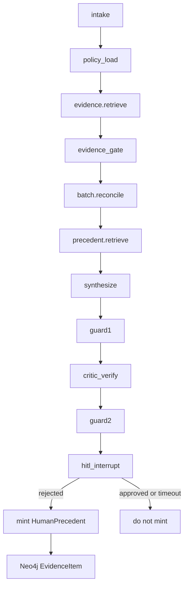

# Shadow QP implementation plan

**Persisted from:** Cursor plan `shadow_qp_plan_ef1c97cb`
**Status:** `active` · **Scope:** `batch_review` only (EU Qualified Person). PV/Supply/other workflows are out of scope (ADR-008 / RR-2).
**Governing ADR:** [`docs/adr/ADR-010-human-precedent-as-evidence.md`](../../docs/adr/ADR-010-human-precedent-as-evidence.md)

V1 is batch_review only: QP rejections become citable EvidenceItems retrieved after reconcile; HITL still decides; approvals never confer authority.

## Problem

[`docs/architecture/agentic/memory_design.md`](../../docs/architecture/agentic/memory_design.md) forbids long-term agent memory. HITL justifications already persist in `human_override_recorded` ([`audit_store.write_human_override`](../../services/integration/audit_store.py)) but agents cannot read them. Every batch pack starts cold.

Shadow QP puts recall on the **only** allowed path: `EvidenceItem` + retrieve + ADR-003 citability. It does **not** auto-approve.

## Non-negotiables

- HITL interrupt remains mandatory; timeout remains no action ([`graph.py` `hitl_interrupt`](../../services/api/graph.py)).
- Mint precedents only for `action=rejected`. Never for `approved` or `timed_out` (avoids “QP approved a similar case” authority leak named in memory_design §2.3).
- No person name on the EvidenceItem — role + role-assignment pattern already used in audit.
- PV/Supply graphs must not import or call the new tool.
- Precedent write is **best-effort after** the audit write: a Neo4j failure must not undo a human decision.
- Synthesize may cite a prior refusal of a **similar gap**; it must not say “reject the batch” (already banned in [`policy_contract.v1.json`](../../security/policies/policy_contract.v1.json)).

## Why a new tool, not extra retrieve terms

[`evidence.retrieve`](../../services/integration/evidence_retrieve.py) matches `terms` against `source_file` / `authority` **before** reconcile. Similar-gap matching needs `BatchPayload.findings`. Adding `"precedent"` to `["BATCH_RELEASE", "policy"]` would dump every QP rejection into every run with no category filter.

Add a **separate** read-only tool `precedent.retrieve`, bound only to batch_review, called **after** `reconcile` and **before** `synthesize`. Same pattern as `batch.reconcile`: hashed contract, no write method, max 1 call/run.

## Governance: ADR-010

[`memory_design.md`](../../docs/architecture/agentic/memory_design.md) §2: reopening cross-run recall requires an ADR. Add [`docs/adr/ADR-010-human-precedent-as-evidence.md`](../../docs/adr/ADR-010-human-precedent-as-evidence.md):

- Cross-run recall is allowed **only** as EvidenceItems retrieved by a hashed read-only tool.
- Citable actions: reject only. Approvals are audit-only.
- Status: `draft` (already in the retrieve citable enum; UI already treats draft as citable-with-caveat in [`apps/web/lib/format.ts`](../../apps/web/lib/format.ts)). Do not invent a new status that the schema enum cannot represent.
- Jurisdiction v1: always `EU` because the only minting role is EU Qualified Person. Do not add `app_user.jurisdiction` in this slice.
- Supersession v1: append-only. No auto-supersede. A later admin/Quality path can set `status=superseded`; ADR-003 then drops it from retrieve automatically.

## Data model (Neo4j EvidenceItem extras)

Reuse `EvidenceItem` MERGE from [`packages/domain/kg/ingest.py`](../../packages/domain/kg/ingest.py). Additional scalar properties (Neo4j cannot store nested maps):

- `authority` = `human_precedent`
- `source_file` = `human_precedent/{source_run_id}.md` (synthetic; never re-parse prose for supersession)
- `status` = `draft`, `trust` = `draft`, `jurisdiction` = `EU`
- `finding_hash` = SHA-256 of sorted `(category, status)` pairs from `BatchPayload.findings` where status is `gap` or `conflict` (exclude `complete`; exclude `batch_id`)
- `finding_categories` = string array of those categories
- `source_run_id`, `source_workflow` = `batch_review`, `action` = `rejected`
- `justification_excerpt` = truncated justification (redaction path same as audit; no PII beyond what HITL already stored)
- `_provenance_*` as ingest already sets

Python `EvidenceItem` in [`packages/domain/evidence.py`](../../packages/domain/evidence.py) stays unchanged (`status` still `approved|draft`). `content_excerpt` carries the excerpt for synthesize/critic.

Idempotency: `MERGE (e:EvidenceItem {evidence_id: $id})` with `evidence_id = HP-{source_run_id}`. Re-deciding the same run cannot create a second node.

## New files

- [`packages/contracts/tool_contracts/precedent_retrieve.schema.json`](../../packages/contracts/tool_contracts/precedent_retrieve.schema.json) — `read_only: true`, `owning_context: Batch Review`, `additionalProperties: false`, `what_this_schema_cannot_express`: disposition, auto-approve, cross-workflow retrieve. Input: `run_id`, `finding_categories`, `finding_hash`, `policy_contract_version`. Output: `items[]` already ADR-003 filtered (`untrusted`/`superseded` excluded in Cypher). Per-run ceiling 1.
- [`services/integration/precedent_retrieve.py`](../../services/integration/precedent_retrieve.py) — Cypher: match `authority = 'human_precedent'` AND `source_workflow = 'batch_review'` AND `status IN ['approved','draft']` AND overlapping `finding_categories` (or equal `finding_hash`). Map Neo4j errors to `STORE_UNAVAILABLE` like evidence retrieve. Empty set is valid (no similar refusals).
- [`services/integration/precedent_mint.py`](../../services/integration/precedent_mint.py) — `mint_rejection(...)`; skip if action != rejected or workflow != batch_review or findings empty; catch Neo4j errors and log.

Register in [`tool_manifest.json`](../../services/integration/tool_manifest.json) and recompute SHA256 via existing [`tool_manifest.py`](../../services/integration/tool_manifest.py) (CI already fails on hash drift).

## Graph and API seams

[`services/api/graph.py`](../../services/api/graph.py) `build_graph` only:

- New node `precedent_retrieve` after `reconcile`. On `STORE_UNAVAILABLE` or empty: leave `evidence` unchanged (run continues). On hits: append items to `state["evidence"]` and increment `tool_calls`.
- Edges: `reconcile` → `precedent_retrieve` → `synthesize` (existing abstain edge from reconcile unchanged).
- `hitl_interrupt`: after successful `write_human_override`, if `decision.action == "rejected"`, call `precedent_mint` with findings + justification + `run_id`. Do not mint inside `decide_run` in [`main.py`](../../services/api/main.py) — the graph already owns the audit write; keep one owner.

Do **not** add `"precedent"` to the existing `terms=["BATCH_RELEASE", "policy"]` list.

## Prompts and StubLLM

[`packages/config/llm_client.py`](../../packages/config/llm_client.py) `_BATCH_SYNTHESIZE_SYSTEM` / `_BATCH_CRITIC_SYSTEM`:

- May cite `human_precedent` items in `evidence`.
- Must not treat them as a disposition or as “the QP would reject this.”
- Phrase as fact: a similar gap was previously not accepted, citing `evidence_id`.

[`services/api/nodes/llm_interface.py`](../../services/api/nodes/llm_interface.py) `StubLLM.synthesize`: if any evidence source/authority contains `human_precedent`, add one cited claim so tests do not need a live model.

## Frontend (minimal)

- [`apps/web/lib/format.ts`](../../apps/web/lib/format.ts): if `source`/`authority` indicates human_precedent, surface a distinct label (e.g. keep status `draft` for citability, add meaning text “Prior QP refusal of a similar gap — not a disposition”).
- Decision detail / evidence list already renders `evidence` + `draft_claims` citations; no new page required for v1.
- Record Assistant: optional extra fact in [`record_chat.py`](../../services/api/record_chat.py) `build_record_card` — count of precedent evidence_ids — still deterministic, no model authority.

## Tests

- Unit `precedent_mint`: mint on reject; no-op on approve/timeout/empty findings; MERGE idempotent on same `run_id`.
- Unit `precedent_retrieve`: category overlap; superseded excluded; PV module does not import the tool (grep/architecture test).
- Contract test against the new schema (`extra=forbid`, `read_only`).
- Grader [`eval-ai-cache/graders/precedent_authority_grader.py`](../../eval-ai-cache/graders/precedent_authority_grader.py): citing `HP-*` with status superseded fails; citing an approval-shaped field fails; a claim that says “reject the batch because of precedent” fails via existing `prohibited_action_grader`.
- Integration (skip if Neo4j unset, same pattern as [`tests/resilience/test_ai_disabled_continuity.py`](../../tests/resilience/test_ai_disabled_continuity.py)): run A reject with a genealogy gap → run B same finding shape → B’s evidence includes `HP-{runA}` → still `__interrupt__` pending HITL.
- Security: after StubLLM path, terminal state is never `completed` without interrupt just because a precedent exists.

## Docs to update when implementing

- Short note in `memory_design.md` pointing at ADR-010 (exception, not a reversal).
- `tool_inventory.md` row for the new tool.
- `docs/architecture/agentic/langgraph_design.md` node table: `precedent_retrieve` as deterministic, Batch Review only.

## Implementation order

1. ADR-010 + persist this plan (if not already in `plans/active/`).
2. Schema + mint + retrieve + manifest hash.
3. Wire `graph.py` node and hitl mint hook.
4. Prompts + StubLLM.
5. Tests + grader.
6. Frontend label + optional Record Assistant fact.

## Out of scope for this slice

- Shadow approvers for PV/Supply/clinical/regulatory.
- Citing approvals as positive authority.
- Semantic embeddings / vector search.
- Auto-supersede chains.
- User-level jurisdiction field.
- Changing `local_approved` citability (frontend currently treats it as not citable in retrieve).
